# POKÉDEX

## Índice

* [1. Introduction](#1-introduction)
* [2. Project Overview ](#2-project-overview)
* [3. Site Instructions](#3-site-instructions)
* [4. User Stories](#4-user-stories)
* [5. Prototypes](#5-prototypes)
* [6. Finished Product ](#7-finished-product)
* [7. User Testing and Feedback](#6-user-testing-and-feedback)
* [8. Contact Information ](#7-contact-information )

***

## 1. Introduction
The Pokédex is as synonymous with Pokémon as Pokéballs. They’ve been a staple of the franchise since day one and actually directly influenced the plot of the first game. In many respects, they’re the direct influencer of every mainline Pokémon game as the games don’t begin in earnest until trainers get their hands on their Pokédex. It’s not hard to see why, either. In an out of universe, the Pokédex is a trainer’s only real way of getting important in-game information. In that regard, it’s a trainer’s most useful tool.

## 2. Project Overview 

This project was created with three different users in mind:
* a Pokemon beginner,
* a Pokemon fan, and
* a Pokemon expert.

It was created working with a set of data, in this case, Pokemon data, adapting it for specific purposes of our users.

Our finished product allows our users to:
1. Properly see a list with every Pokemon,
2. Filter pokemons by their type,
3. Order pokemons according to their name, weight, height, and id,
4. Search specific pokemons by name or number,
5. Save their favorite pokemons, and erase them whenever the want.
6. Visualize a window for each character with additional data,
7. See graphic charts and statistics of pokemons.

It was created on our fourth week of coding bootcamp, with a deadline of three weeks for this project.

You can find it live on the top of this page, using our Github pages link.

## 3. Site Instructions 

### Header

For optimum experience, make sure your cookies are activated. This site requires them to allow you to save your favorite pokemons.

On the header of the page, we included four buttons.
* An About Button (to know more about our page)
* A Language Button (to change language to English or Spanish) 
* A Favorites Button (to see saved pokemons)
* A Statistics Button (to see graphic charts about pokemons)

We have also facilited for you a clickable title, to make you go to the top of the page easier and faster, and for refreshing the site to the main page, as well as a home button for navegating between the different pages.

### Main Body

On the main body, you will be able to see cards for every pokemon. If you wish to see what type a pokemon is, you can do so by simply hovering over the card with your mouse. For mobile devices, you will be able to do it by clicking just once. 

### Character window

When you wish to see specific and more detailed data for a pokemon, you can click and a pop over window will be displayed. 

This window includes each pokemon's:
* Type
* Weight
* Height 
* Candy type
* Candy Count
* Weaknesses
* Description
* Evolution

We have also included a text-to-speech function, that reads the description of the displayed Pokemon. Try it out by clicking the audio button!

On the top of this window you will find a pokeball; by clicking it, you are able to save that pokemon to your favorites. If you wish to remove it, you can do so by simply clicking on the star that appears after it´s saved.

### Floating Menu

On the bottom-right of the site, you will find a circle with a plus sign on it. By clicking, a menu will be displayed. 

On the menu, you will have four different options:
1. A Refresh Button
2. A Sort Button
3. A Filter by Type Button
4. A Search Button

While pretty self-explanatory, you will be able to:
- refresh the site to discard any filter or sorting options you chose,
- sort pokemons by alphabetical order, weight, height, or id,
- filter pokemons to only display the pokemon with the type you chose(there are 15 different types)
- search a specific pokemon by name or number.

To close the floating menu, just click on the closing button at the bottom.

For any questions make sure to contact us to clear them for you.

## 4. User Stories

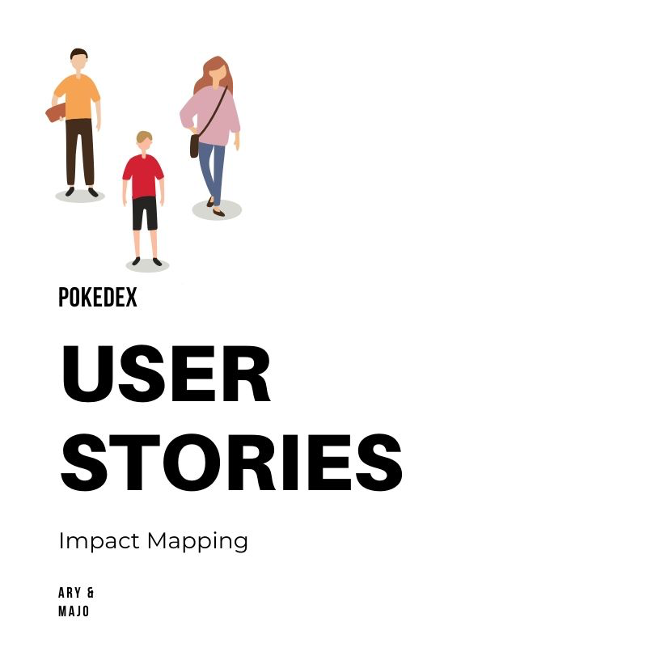

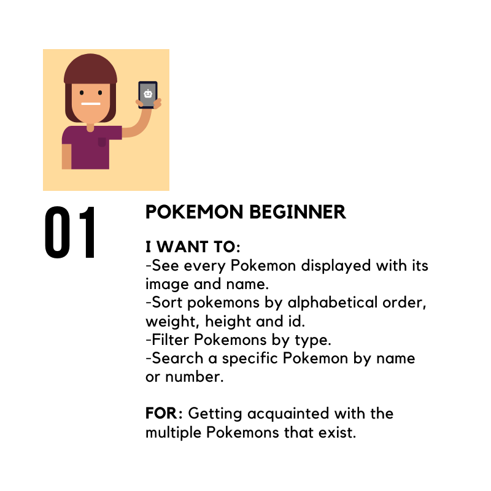

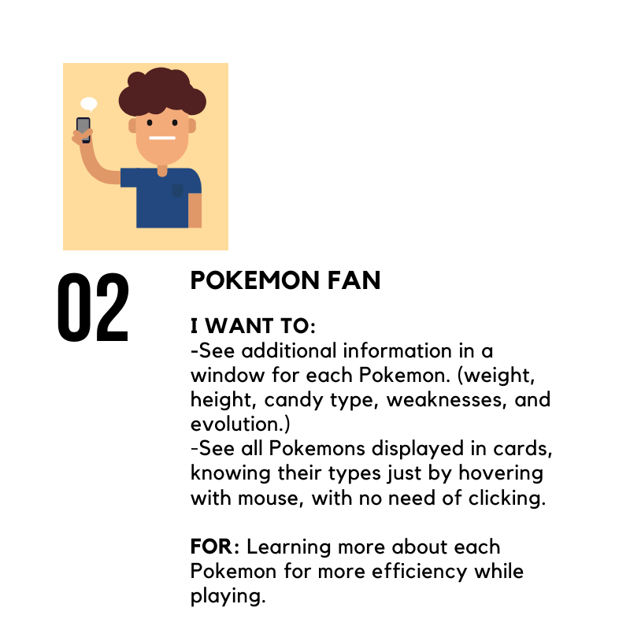

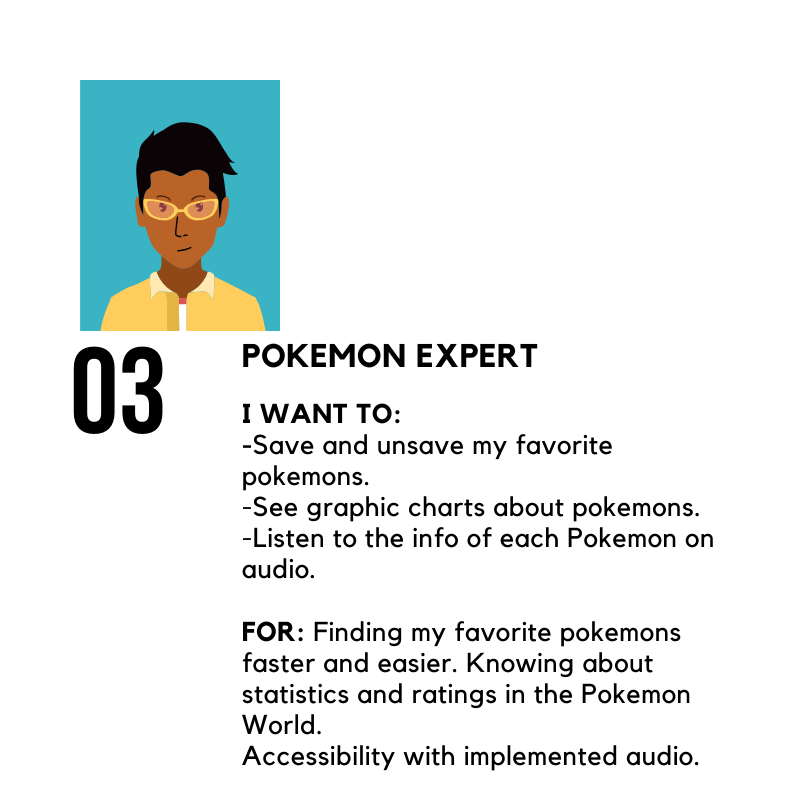

## 5. Prototypes

### Sketched Prototypes

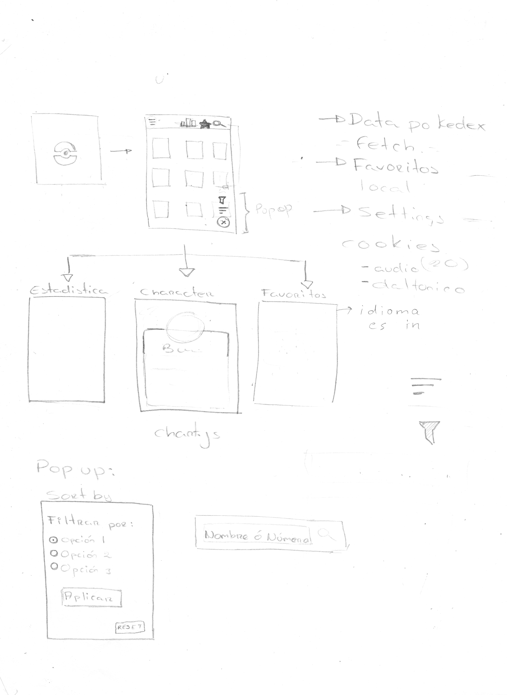
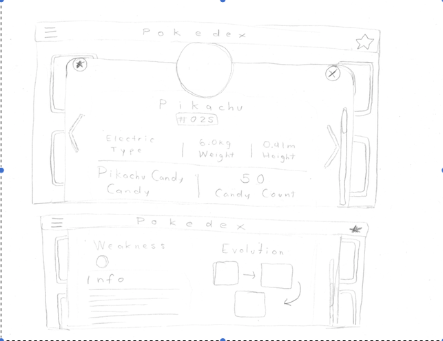

### High Fidelity Prototypes
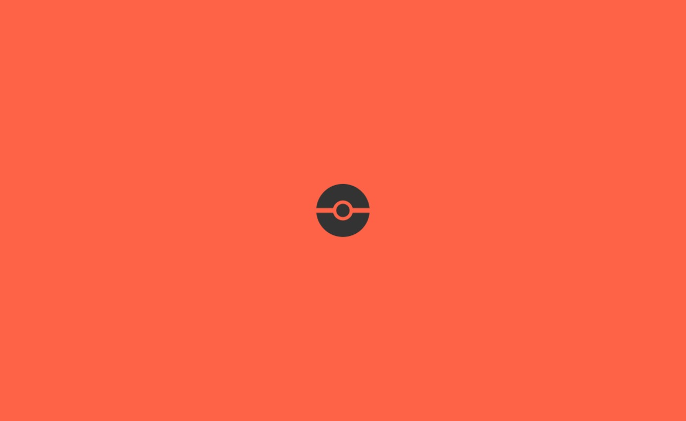
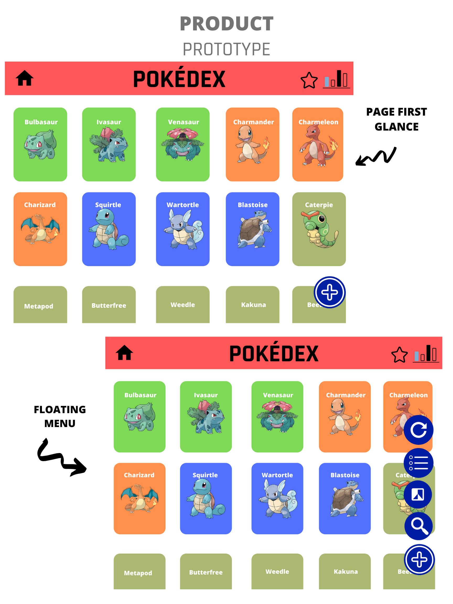
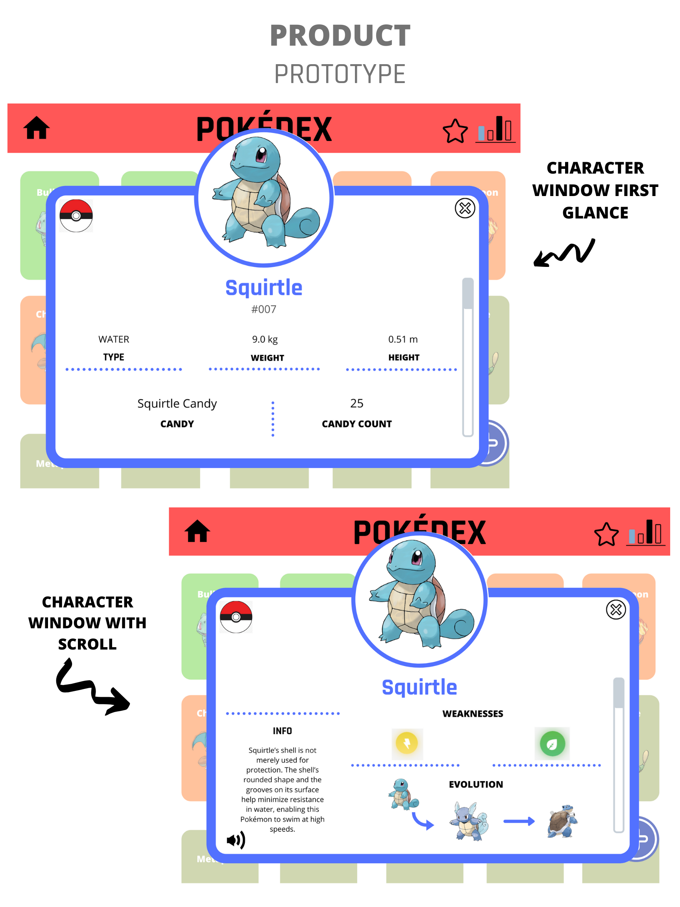
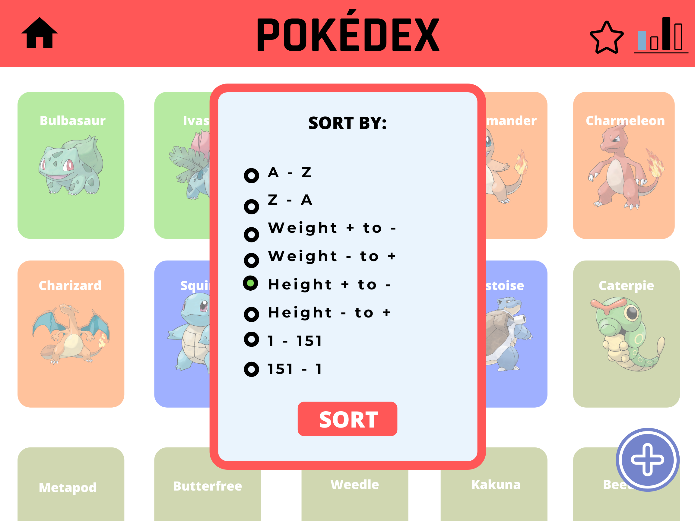

## 6. Finished Product
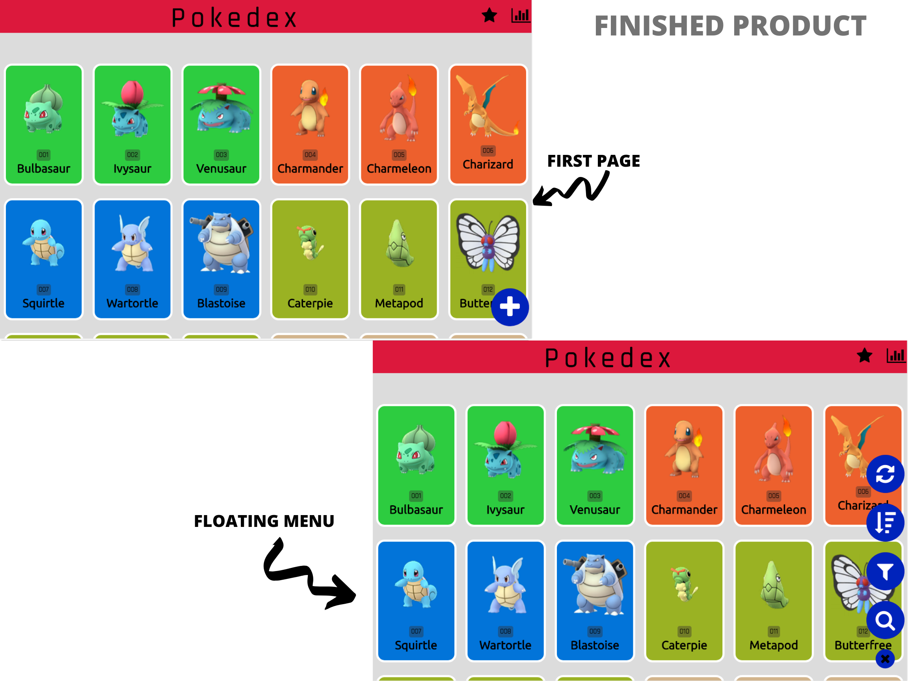
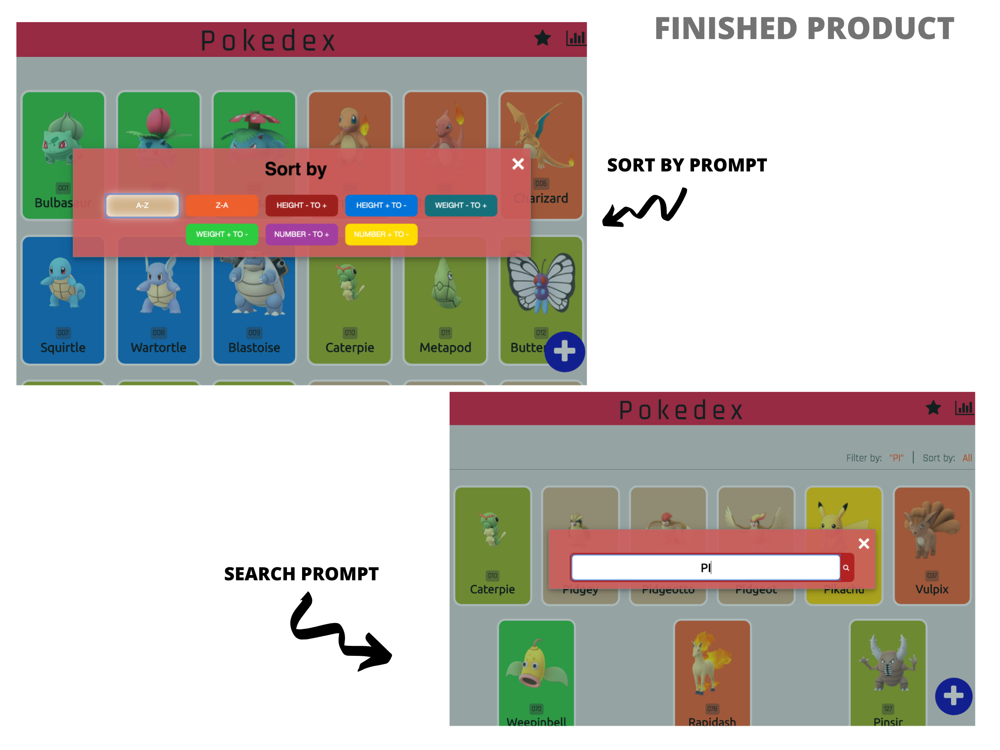
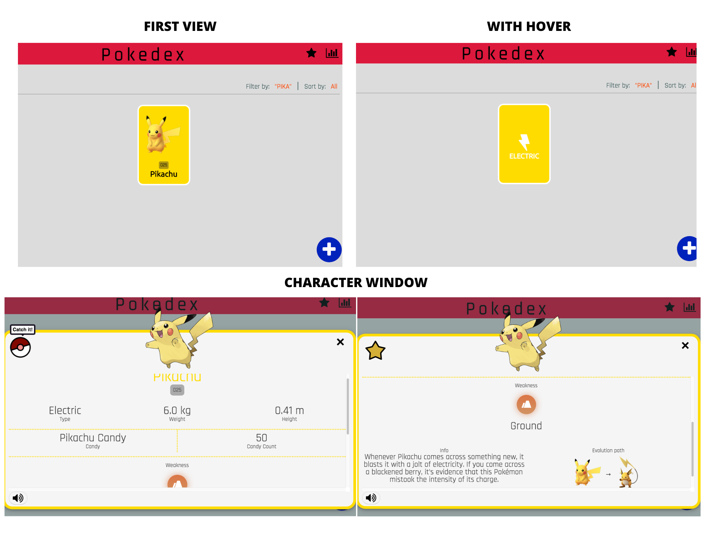

## 7. User Testing and Feedback

### Sprint working and SCRUM
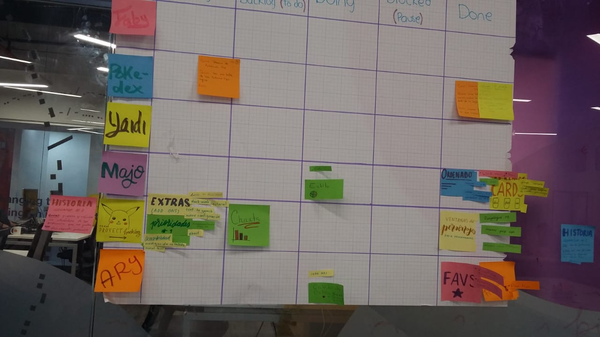

<!-- #### Testeos de usabilidad

Durante el reto deberás hacer _tests_ de usabilidad con distintos usuarios, y
en base a los resultados, deberás iterar tus diseños. Cuéntanos
qué problemas de usabilidad detectaste a través de los _tests_ y cómo los
mejoraste en tu propuesta final. -->

## 8. Contact Information 

- AryMF  
[Ary's Github](https://github.com/AryMF)  
Ary's email: ariadne.hp@gmail.com   
- Majo Aquino  
[Majo's Github](https://github.com/majoaquino99) 
Majo's email: majo.aqh@gmail.com

